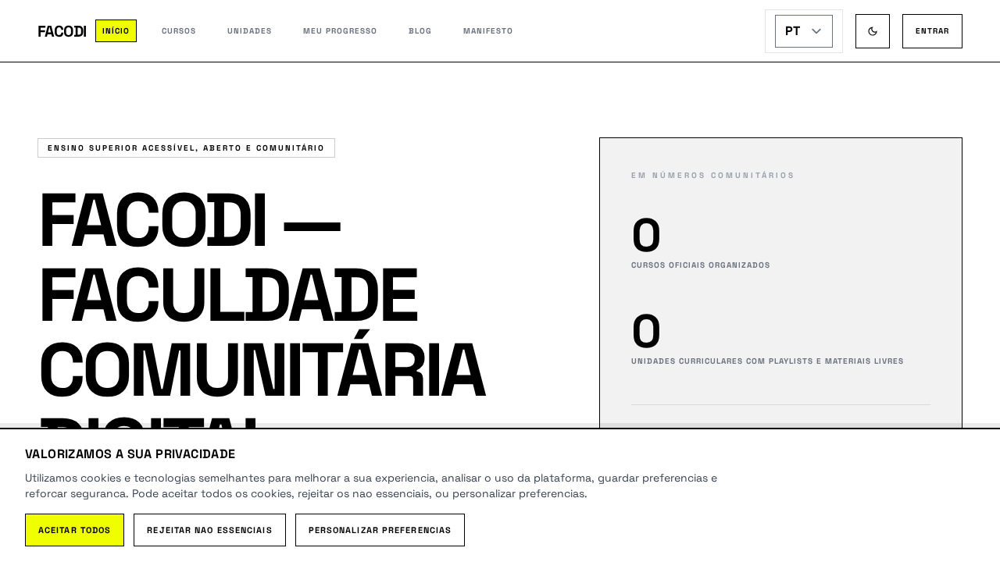
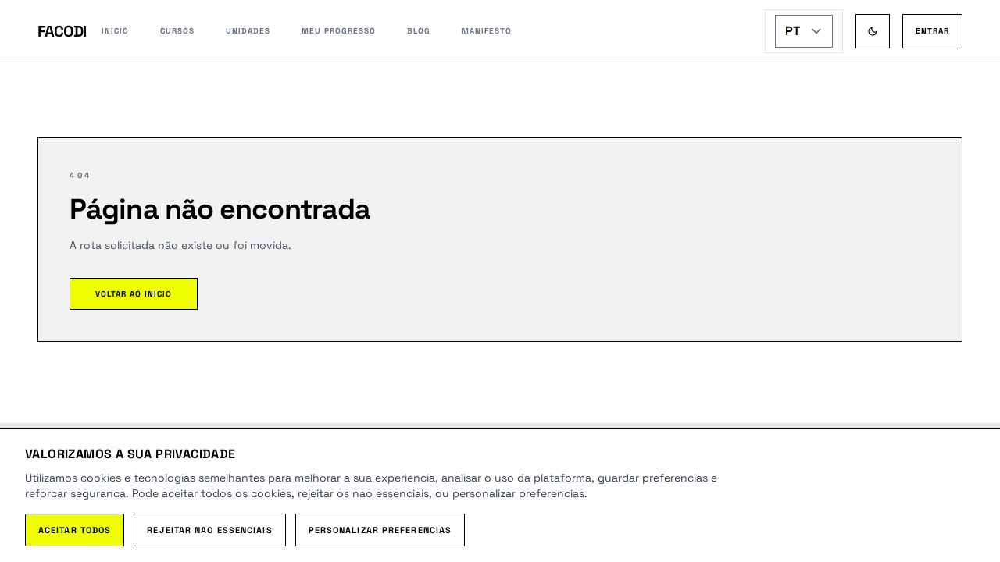

# My Progress Consolidation Report

## 1) What was merged into My Progress
- Enrolled courses overview (previously split across student dashboard and my-courses pages).
- Aggregate progress indicator and per-course progress cards.
- Continue-learning section based on in-progress content.
- Recent activity timeline section.
- Single protected entry route at `/dashboard`.

## 2) What was removed from My Courses
- Standalone pages removed:
  - `components/student/StudentDashboard.tsx`
  - `components/student/StudentMyCoursesPage.tsx`
  - `components/student/StudentProgressPage.tsx`
  - `components/student/StudentHistoryPage.tsx`
- Standalone hook removed:
  - `hooks/useMyCourses.ts`
- Standalone service function removed:
  - `getMyCourses()` from `services/studentSource.ts`
- Legacy student e2e suites removed:
  - `tests/e2e/student-my-courses.spec.ts`
  - `tests/e2e/student-progress.spec.ts`
  - `tests/e2e/student-history.spec.ts`

## 3) Which database structures were consolidated
- Canonical learning-progress model retained and used as the source of truth:
  - `public.course_enrollments`
  - `public.content_progress`
  - `public.student_activity_events`
- Generated frontend types were synchronized to live schema in `services/supabase.types.ts`.

## 4) Which structures were removed
- Frontend-only obsolete route/view/hook/page/test structures listed above.
- No canonical progress tables were dropped.
- Added migration for performance hardening (not removal):
  - `supabase/migrations/20260510221500_add_student_activity_event_fk_indexes.sql`

## 5) Architectural improvements
- One canonical learning hub route (`/dashboard`) instead of fragmented `/student/*` pages.
- One primary dashboard composition in `components/Dashboard.tsx` for progress-oriented UX.
- One canonical aggregate data path (`useStudentDashboard` + `getStudentDashboard`).
- Reduced route-state complexity in `App.tsx` by removing dedicated student view variants.

## 6) UX improvements
- Users now discover progress, enrolled courses, continue-learning, and activity in one place.
- Desktop/mobile navigation now emphasizes a single progress destination.
- Reduced ambiguity between labels “Meu Progresso” and “Meus Cursos”.

## 7) Simplified flows
- Before: `home -> /student/dashboard|/student/my-courses|/student/progress|/student/history`
- After: `home -> /dashboard` (single protected flow)
- Legacy `/student/*` paths now resolve to not-found, avoiding parallel maintenance paths.

## 8) Remaining technical risks
- Repository-wide typecheck still reports unrelated pre-existing issues outside this consolidation scope (edge function Deno typing, curator pipeline test typings, and unrelated source typing errors).
- Full e2e suite contains pre-existing non-dashboard failures (environment/auth/network assumptions).
- Local migration history in `supabase/migrations/` may still be incomplete versus remote history; a reconciliation pass is recommended.

## 9) Screenshots before/after
- Before baseline screenshots were not captured prior to implementation in this run.
- After screenshots:
  - Unified dashboard route behavior: 
  - Legacy my-courses route removed (not-found): 
  - Home navigation after consolidation: 

## 10) Migration considerations
- Apply migration `20260510221500_add_student_activity_event_fk_indexes.sql` to address FK index advisories.
- Re-run Supabase advisors after migration apply and confirm reduced warnings.
- Keep canonical progress tables (`course_enrollments`, `content_progress`, `student_activity_events`) intact.
- If route compatibility is later required, add explicit redirect policy in a controlled migration/release note instead of reintroducing parallel pages.

## Validation executed in this implementation cycle
- `pnpm build`: passed.
- `pnpm test:e2e tests/e2e/student-dashboard.spec.ts`: passed (6/6).
- Full `tsc --noEmit`: fails due pre-existing unrelated issues outside this scope.
